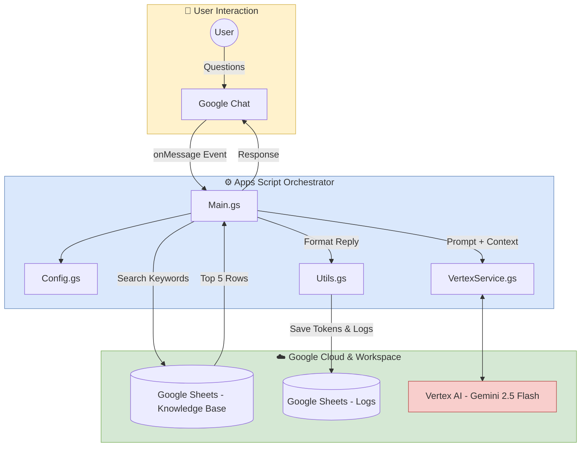

    <b>Select Language:</b> 
    <a href="README.md">🇺🇸 English</a> |
    <a href="README.sp.md">🇪🇸 Español</a>

---

# 🤖 Google Chat AI Product Assistant: Workspace + Vertex AI

## 🎯 Project Objective
This project implements an intelligent conversational agent within **Google Chat**, designed to answer product-specific questions and provide KPIs. It integrates Google Workspace (Chat, Sheets) with the power of **Vertex AI (Gemini 2.5 Flash)** to deliver fast, context-aware responses directly to users.

## 💡 Solution: "Simulated RAG" via Prompt Engineering
Unlike complex Retrieval-Augmented Generation (RAG) systems that require vector databases, this lightweight orchestrator uses a **Contextual Keyword Search Engine**. 
It scans user input for product names, searches a Google Sheet for matching records, and dynamically injects the top 5 relevant rows directly into the LLM's prompt. 

### Key Features:
* **Context Anchoring:** The bot "remembers" the current product being discussed using Apps Script `CacheService`, allowing for natural follow-up questions.
* **Cost-Effective Knowledge Base:** Uses Google Sheets as a highly accessible, easily updatable database for product KPIs and details.
* **Automated Audit Logging:** Every interaction, including token usage and AI responses, is logged in a separate Google Sheet tab for analytics.
* **Modular Architecture:** Clean separation of concerns (Config, Main, AI Services, Utils) for easy maintenance.

---

## 🏗️ System Architecture
The codebase is modularized to ensure scalability and ease of maintenance:

* **`Main.gs`**: Google Chat event handlers (`onMessage`) and the core keyword search logic.
* **`Config.gs`**: Centralized environment variables and project constants.
* **`VertexService.gs`**: Integration layer with the Vertex AI API (Gemini).
* **`Utils.gs`**: Helper functions for logging consumption and formatting Google Chat responses.

## ⚙️ Setup & Deployment

### 1. Google Cloud Platform (GCP) Configuration
* Enable **Google Chat API** and **Vertex AI API** in your GCP Project.
* Link your Apps Script project to your GCP Project number.

### 2. Environment Variables (Script Properties)
Configure the following keys in **Project Settings > Script Properties**:

| Property | Description |
| :--- | :--- |
| `PROJECT_ID` | Your GCP Project ID (e.g., `pe-pocs-ia-gen`). |
| `DOC_ID` | Associated document ID (if applicable). |
| `SHEET_ID` | The ID of the Google Sheet acting as your Knowledge Base and Log database. |

### 3. Google Chat API Configuration
In the Google Cloud Console, under the Google Chat API settings:
* Set the App Status to "Live – available to users".
* Under "Connection settings", select **Apps Script project** and paste your Deployment ID.

---

## 🚀 What's Next (Future Enhancements)
While the current prompt-injection method is highly efficient for small datasets, the system can be evolved into an enterprise-grade solution:

1. **True RAG Integration:** Replace the Sheets text search with **Vertex AI Search and Conversation** or a Vector Database (like AlloyDB or Pinecone) to handle thousands of documents with semantic search.
2. **Persistent Memory:** Migrate from the temporary `CacheService` to **Firestore** to maintain long-term user session history and preferences.
3. **Interactive UI:** Implement Google Chat **Card Messages** instead of plain text to display KPIs in structured, visual formats (buttons, tables, images).