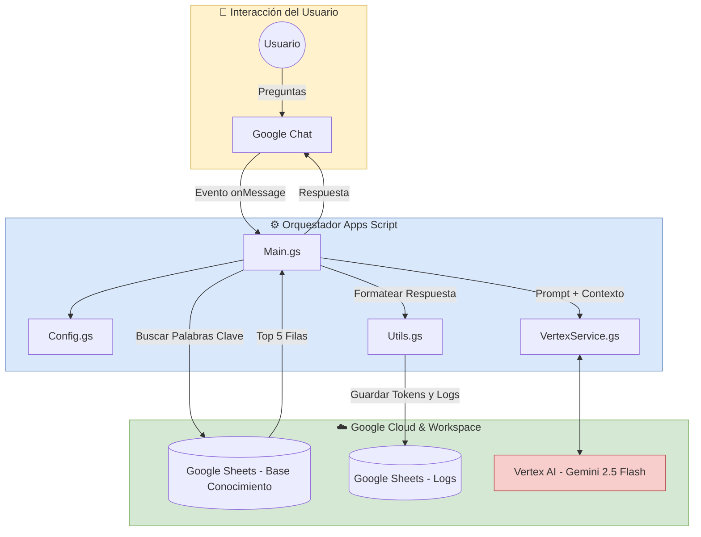

```markdown
<p align="center">
    <b>Select Language:</b><br>
    <a href="README.md">🇺🇸 English</a> |
    <a href="README.sp.md">🇪🇸 Español</a>
</p>

---

# 🤖 Asistente IA de Productos en Google Chat: Workspace + Vertex AI

## 🎯 Objetivo del Proyecto
Este proyecto implementa un agente conversacional inteligente dentro de **Google Chat**, diseñado para responder preguntas específicas sobre productos y proporcionar KPIs. Integra el ecosistema de Google Workspace (Chat, Sheets) con el poder de **Vertex AI (Gemini 2.5 Flash)** para ofrecer respuestas rápidas y contextualizadas directamente a los usuarios.

## 💡 Solución: "RAG Simulado" mediante Prompt Engineering
A diferencia de los sistemas complejos de Generación Aumentada por Recuperación (RAG) que requieren bases de datos vectoriales, este orquestador ligero utiliza un **Motor de Búsqueda Contextual por Palabras Clave**. 
Escanea el texto del usuario en busca de nombres de productos, busca coincidencias en Google Sheets e inyecta dinámicamente las 5 filas más relevantes directamente en el prompt del LLM.

### Características Principales:
* **Anclaje de Contexto:** El bot "recuerda" el producto del que se está hablando usando el `CacheService` de Apps Script, permitiendo preguntas de seguimiento naturales.
* **Base de Conocimiento Rentable:** Utiliza Google Sheets como una base de datos altamente accesible y fácil de actualizar para los KPIs y detalles de los productos.
* **Auditoría Automatizada:** Cada interacción, incluyendo el consumo de tokens y las respuestas de la IA, se registra en una pestaña separada de Google Sheets para su análisis.
* **Arquitectura Modular:** Separación clara de responsabilidades (Config, Main, Servicios de IA, Utils) para facilitar el mantenimiento.

---

## 🏗️ Arquitectura del Sistema
El código base está modularizado para garantizar la escalabilidad:

* **`Main.gs`**: Manejador de eventos de Google Chat (`onMessage`) y la lógica central de búsqueda.
* **`Config.gs`**: Variables de entorno centralizadas y constantes del proyecto.
* **`VertexService.gs`**: Capa de integración con la API de Vertex AI (Gemini).
* **`Utils.gs`**: Funciones de ayuda para registrar el consumo y formatear las respuestas de Google Chat.



## ⚙️ Configuración y Despliegue

### 1. Configuración de Google Cloud Platform (GCP)
* Habilita la **API de Google Chat** y la **API de Vertex AI** en tu proyecto de GCP.
* Vincula tu proyecto de Apps Script a tu número de proyecto de GCP.

### 2. Variables de Entorno (Script Properties)
Configura las siguientes claves en **Configuración del proyecto > Propiedades de la secuencia de comandos**:

| Propiedad | Descripción |
| :--- | :--- |
| `PROJECT_ID` | El ID de tu proyecto en GCP (ej., `pe-pocs-ia-gen`). |
| `DOC_ID` | ID del documento asociado (si aplica). |
| `SHEET_ID` | El ID de la hoja de cálculo de Google que actúa como Base de Conocimiento y Log. |

### 3. Configuración de la API de Google Chat
En la consola de Google Cloud, en la configuración de la API de Google Chat:
* Establece el estado de la aplicación en "Activo: disponible para los usuarios".
* En "Configuración de conexión", selecciona **Proyecto de Apps Script** y pega tu ID de implementación (Deployment ID).

---

## 🚀 Próximos Pasos (Futuras Mejoras)
Aunque el método actual de inyección de prompts es muy eficiente para conjuntos de datos pequeños, el sistema puede evolucionar hacia una solución de nivel empresarial:

1. **Integración RAG Real:** Reemplazar la búsqueda de texto de Sheets por **Vertex AI Search and Conversation** o una Base de Datos Vectorial (como AlloyDB o Pinecone) para manejar miles de documentos con búsqueda semántica real.
2. **Memoria Persistente:** Migrar del almacenamiento temporal `CacheService` a **Firestore** para mantener el historial de sesiones y preferencias de los usuarios a largo plazo.
3. **Interfaz Visual Avanzada (UI):** Implementar **Mensajes de Tarjeta (Card Messages)** de Google Chat en lugar de texto plano para mostrar los KPIs en formatos estructurados y visuales (botones, tablas, imágenes).